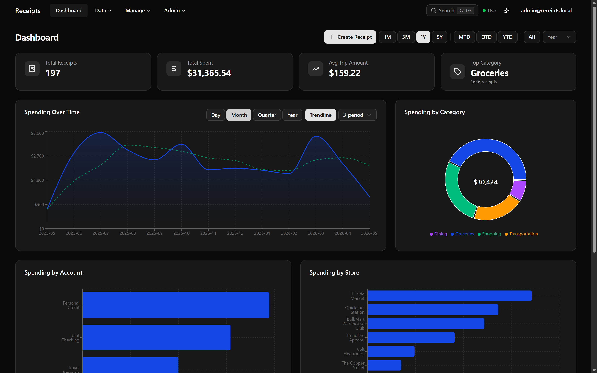
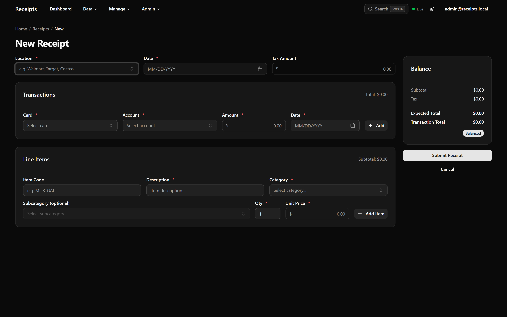
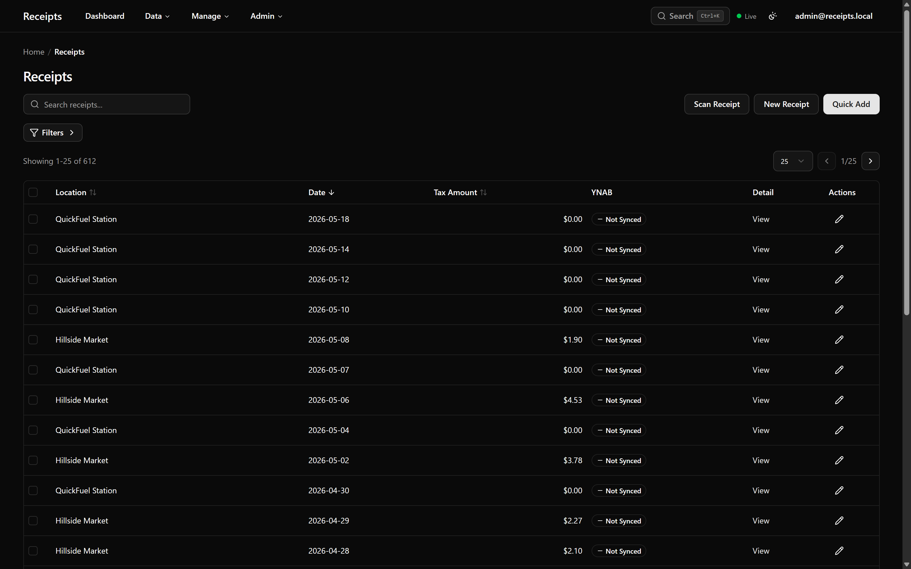
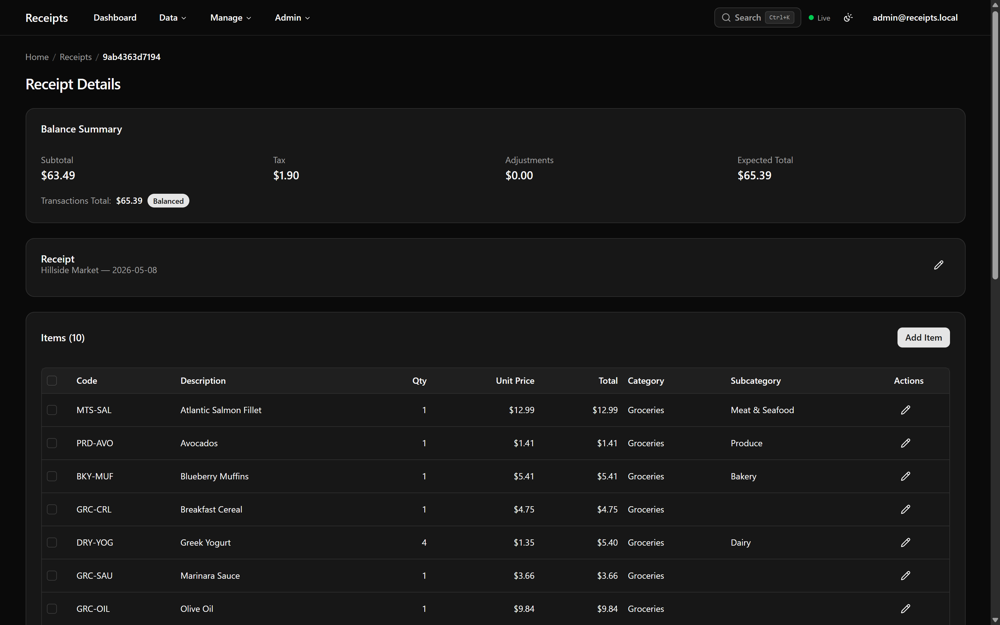
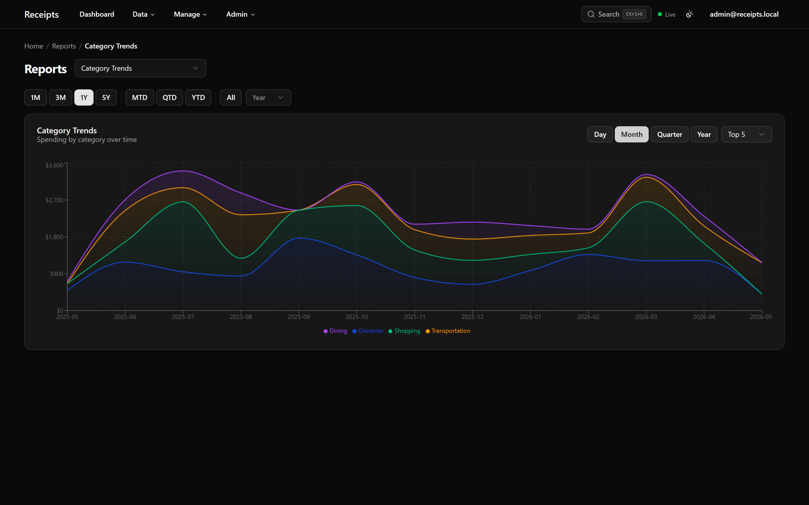

<div align="center">

# 🧾 Receipts

### Self-hosted spending tracker that turns a shoebox of paper receipts into searchable, reconciled financial data.

Capture a receipt down to the line item, reconcile it against the card transactions that paid for it, and watch the dashboards fill in. Built as a production-grade full-stack application — .NET 10 Clean Architecture on the back end, a React 19 single-page app on the front.

[](https://github.com/mggarofalo/Receipts/actions/workflows/github-ci.yml)
&nbsp;
&nbsp;
&nbsp;
&nbsp;

<br />



</div>

---

## Why it exists

Most receipts end up in a drawer and never get looked at again. Receipts makes capturing them low-effort and the resulting data genuinely useful: every purchase is broken down to the line item, categorized, and tied to the card it was paid on — so the question "what did we actually spend on groceries last quarter?" has a real answer.

It is designed to be **self-hosted**: one Docker Compose file, your data on your own hardware, no third-party SaaS holding your financial history.

## Highlights

### ✍️ Enter a receipt precisely, with live reconciliation

The editor models a receipt the way the paper does: line items, tax, adjustments (tips, coupons, discounts), and the card transactions that paid for it. A running **balance panel** confirms the receipt reconciles to the penny before you save.

<div align="center">

</div>

### 🔎 Every receipt, searchable and itemized

Browse, filter, and full-text search across the whole history. Open any receipt to see its line items, denormalized categories, adjustments, and a balance summary that flags discrepancies between what was itemized and what was charged.

<div align="center">

&nbsp;

</div>

### 📊 Reports that answer real questions

A dashboard of spending trends and category breakdowns, plus focused reports: category trends over time, spending by location, item cost history, duplicate detection, uncategorized items, and an **out-of-balance** report that surfaces receipts whose transactions don't match their items.

<div align="center">

</div>

### 🧠 Smarter categorization with local embeddings

Item descriptions are normalized using sentence embeddings (`bge-large-en-v1.5` via ONNX Runtime, stored in `pgvector`) so "BNNS ORG" and "Organic Bananas" collapse to the same thing — all computed locally, with no embedding API key required.

### 🔗 YNAB integration

Two-way sync with [You Need A Budget](https://www.youneedabudget.com/): push receipt detail into YNAB transaction memos and keep categorization aligned.

### 🛠️ Built to be operated

Soft-delete with a recycle bin, a full audit log of every mutation, role-based access with admin user management, scoped API keys, and one-command backup/restore.

## Architecture

Receipts follows **Clean Architecture** with a strict inward dependency rule — the domain has no outward dependencies, and each layer only knows about the ones beneath it. That keeps business rules isolated from frameworks and makes the system straightforward to test.

```
Domain  ←  Application  ←  Infrastructure  ←  Presentation (API)
                                                    ↑
                                              React SPA (client)
```

| Decision | Rationale |
|---|---|
| **CQRS via [martinothamar/Mediator](https://github.com/martinothamar/Mediator)** | Commands and queries are separate types with source-generated dispatch — no reflection, no runtime handler scan. |
| **Compile-time mapping with [Mapperly](https://mapperly.riok.app/)** | Domain ⇄ entity ⇄ DTO mapping is generated at build time — fully debuggable, and a schema change becomes a build error. |
| **Spec-first API** | Request/response DTOs are generated from an OpenAPI spec; drift between the spec, the server, and the typed client is caught in CI. |
| **PostgreSQL + pgvector** | One database for relational data *and* the embedding vectors that power description normalization. |
| **.NET Aspire** | Orchestrates the whole stack — API, database, client, dashboards — for a single-command local dev experience. |

For the full breakdown — layer responsibilities, the description-normalization pipeline, validation tiers, and testing strategy — see **[docs/architecture.md](docs/architecture.md)**.

## Tech stack

| Layer | Technology |
|---|---|
| Runtime | .NET 10 |
| API | ASP.NET Core Web API, Microsoft.AspNetCore.OpenApi + Scalar |
| Frontend | React 19, Vite, TypeScript |
| UI | Tailwind CSS 4, shadcn/ui, Radix UI |
| State & data | TanStack Query, React Router, React Hook Form, Zod |
| Database | PostgreSQL 17 + EF Core 10 + pgvector |
| Embeddings | `bge-large-en-v1.5` via ONNX Runtime (local, 1024-dim) |
| CQRS / mapping / validation | martinothamar/Mediator, Mapperly, FluentValidation |
| Auth | JWT Bearer + scoped API keys (dual scheme) |
| Real-time & observability | SignalR, Serilog, OpenTelemetry |
| Local dev | .NET Aspire |
| Testing | xUnit, FluentAssertions, Moq · Vitest, Testing Library |

## Getting started

**Prerequisites**

- [.NET 10 SDK](https://dotnet.microsoft.com/download)
- [Aspire CLI](https://aspire.dev/get-started/install-cli/) — `dotnet tool install --global Aspire.Cli`
- [Docker Desktop](https://www.docker.com/products/docker-desktop/) — Aspire provisions PostgreSQL as a container
- [Node.js](https://nodejs.org) — for the React client and OpenAPI tooling

**Run it**

```bash
git clone https://github.com/mggarofalo/Receipts.git
cd Receipts
npm install
aspire run --project src/Receipts.AppHost/Receipts.AppHost.csproj
```

Aspire orchestrates the entire stack — API, PostgreSQL, the React dev server, and the Aspire dashboard — and applies database migrations automatically. Local runs are **seeded with three years of realistic sample data** (~600 receipts across seven stores), so the dashboards and reports are populated the moment the app comes up. No manual database setup required.

Press **F5** in VS Code for the same experience with the debugger attached. For F5 details, the Aspire dashboard, and troubleshooting, see **[docs/development.md](docs/development.md)**.

**Deploy it**

The repo includes a self-contained `docker-compose.yml` — secrets are generated on first run, no `.env` file needed:

```bash
docker compose up -d
docker compose exec app cat /secrets/admin_password   # the generated admin password
```

See **[docs/deployment.md](docs/deployment.md)** for HTTPS, backups, and updates.

## Documentation

| | |
|---|---|
| [Architecture](docs/architecture.md) | Layers, patterns, and the receipt pipeline |
| [Development](docs/development.md) | Local setup, debugging, build & test commands |
| [Testing](docs/testing.md) | Test strategy, conventions, and coverage |
| [Deployment](docs/deployment.md) | Docker Compose, HTTPS, operations |
| [Observability](docs/observability.md) | OpenTelemetry, Grafana, and Sentry |
| [Admin & backup](docs/admin.md) | User management, API keys, audit log |

The REST API is fully documented with OpenAPI metadata — run the app and open `/scalar` for an interactive reference.

## License

© Michael Garofalo. All rights reserved.
